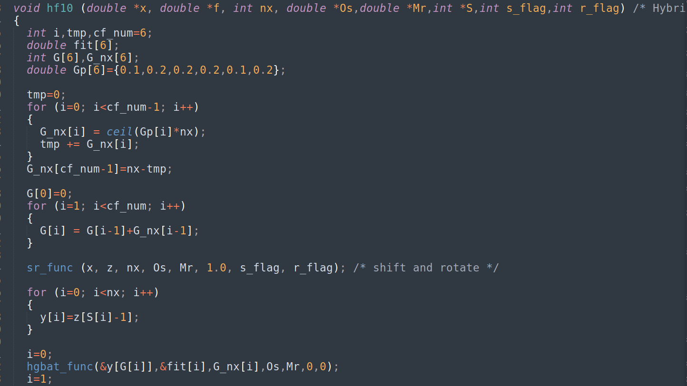
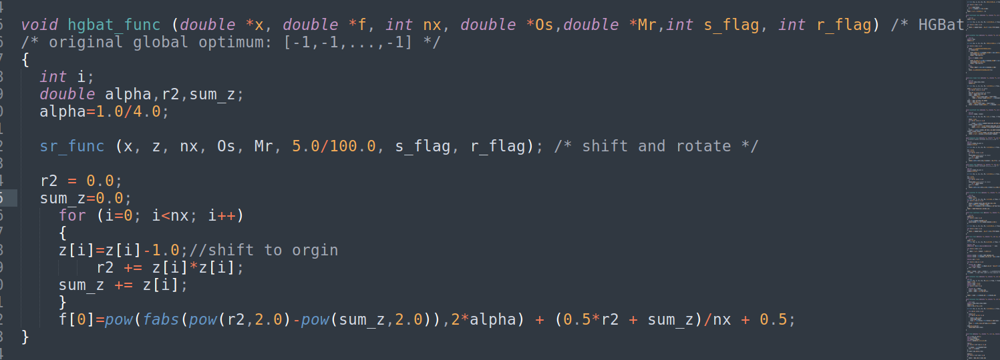
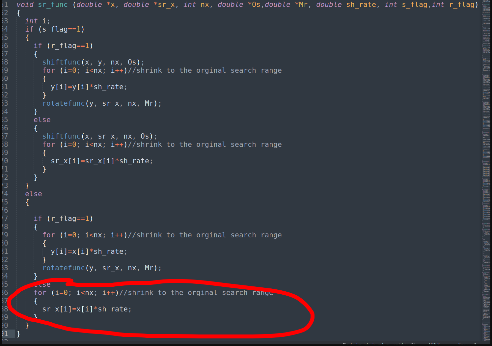
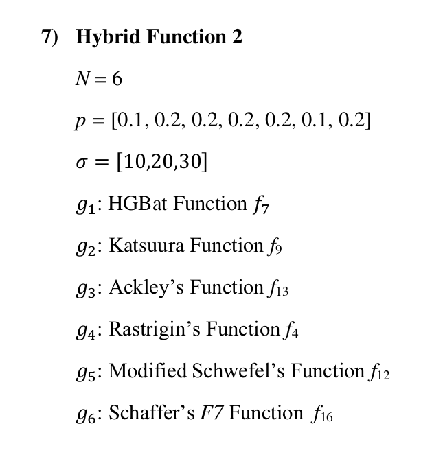
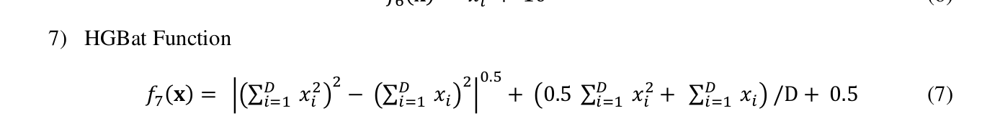

# Regarding the C++-17 implementation of the CEC2022 functions

There are some discrepancies between the C code provided by by Ryoji Tanabe and the PDF file:

Discrepancy 1:
```
In the C code: Hybrid Function 2 rotates its HGBat part.
In the PDF file: Hybrid Function 2 includes the raw HGBat function.
```








Should the HGBat function be scaled, although there is no scale variable in the definition?
